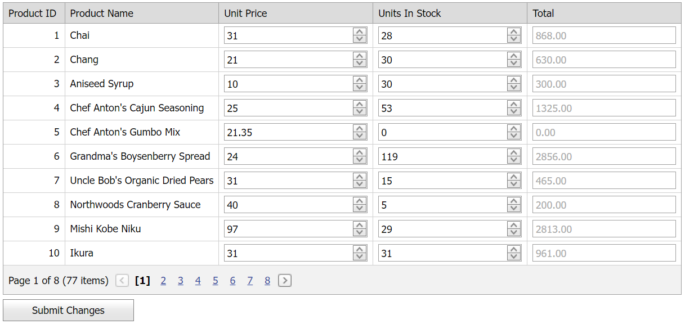

<!-- default badges list -->

[](https://supportcenter.devexpress.com/ticket/details/E3929)
[](https://docs.devexpress.com/GeneralInformation/403183)
[](#does-this-example-address-your-development-requirementsobjectives)
<!-- default badges end -->
# Grid View for ASP.NET Web Forms - How to calculate templated column values on the client

This example demonstrates how to create an unbound column (**Total**) that changes its value based on templated column values.



## Overview

Follow the steps below to calculate templated column values on the client:

1. Specify a data column's [DataItemTemplate](https://docs.devexpress.com/AspNet/DevExpress.Web.GridViewDataColumn.DataItemTemplate) property, add a spin editor to the template, and bind the editor to the corresponding column values.

    ```aspx
    <dx:GridViewDataTextColumn FieldName="UnitsInStock" VisibleIndex="5">
        <DataItemTemplate>
            <dx:ASPxSpinEdit ID="seUnitInStock" runat="server" Number="0" Value='<%# Bind("UnitsInStock") %>'
                OnInit="seQuantity_Init" />
        </DataItemTemplate>
    </dx:GridViewDataTextColumn>
    ```

2. Create an unbound column to display the calculation results, specify the column's [DataItemTemplate](https://docs.devexpress.com/AspNet/DevExpress.Web.GridViewDataColumn.DataItemTemplate) property, and add a text box editor to the template.

    ```aspx
    <dx:GridViewDataTextColumn FieldName="Total" VisibleIndex="6" UnboundType="Decimal">
        <DataItemTemplate>
            <dx:ASPxTextBox ID="tbTotal" runat="server" ClientEnabled="False" OnInit="tbTotal_Init" />
        </DataItemTemplate>
        <!-- ... -->
    </dx:GridViewDataTextColumn>
    ```

3. Handle the grid's server-side [CustomUnboundColumnData](https://docs.devexpress.com/AspNet/DevExpress.Web.ASPxGridView.CustomUnboundColumnData) event to calculate unbound column values.

    ```csharp
    protected void grdProducts_CustomUnboundColumnData(object sender, DevExpress.Web.ASPxGridViewColumnDataEventArgs e) {
        if(e.Column.FieldName == "Total") {
            decimal price = (decimal)e.GetListSourceFieldValue("UnitPrice");
            int quantity = Convert.ToInt32(e.GetListSourceFieldValue("UnitsInStock"));
            e.Value = price * quantity;
        }
    }
    ```

4. Handle the spin editor's client-side [NumberChanged](https://docs.devexpress.com/AspNet/js-ASPxClientSpinEdit.NumberChanged) event to calculate the resulting values of the unbound column. Use a hidden field control to store the calculated values.

    ```js
    function OnCalculateTotal(visibleIndex, keyValue) {
        var controlCollection = ASPxClientControl.GetControlCollection();
        var unitPrice = controlCollection.GetByName("seClientPrice_" + visibleIndex).GetNumber();
        var unitsInStock = controlCollection.GetByName("seClientQuantity_" + visibleIndex).GetNumber();
        var total = unitPrice * unitsInStock;
        controlCollection.GetByName("tbClientTotal_" + visibleIndex).SetText(total.toFixed(2));
        hfChanges.Set("Row_" + visibleIndex.toString(), keyValue + "|" + unitPrice + "|" + unitsInStock);
    }
    ```

    ```aspx
    <dx:ASPxHiddenField ID="hf" runat="server" ClientInstanceName="hfChanges" />
    ```

    ```csharp
    protected void seQuantity_Init(object sender, EventArgs e) {
        ASPxSpinEdit spinEdit = (ASPxSpinEdit)sender;
        GridViewDataItemTemplateContainer container = spinEdit.NamingContainer as GridViewDataItemTemplateContainer;
        spinEdit.ClientInstanceName = String.Format("seClientQuantity_{0}", container.VisibleIndex);
        spinEdit.ClientSideEvents.NumberChanged = String.Format("function(s, e) {{ OnCalculateTotal({0},{1}); }}", container.VisibleIndex, container.KeyValue);
    }
    ```

5. To update the data source, send a postback to the server on a button click.

## Files to Review

* [Default.aspx](./CS/WebSite/Default.aspx) (VB: [Default.aspx](./VB/WebSite/Default.aspx))
* [Default.aspx.cs](./CS/WebSite/Default.aspx.cs) (VB: [Default.aspx.vb](./VB/WebSite/Default.aspx.vb))

## Documentation

* [Grid View Templates](https://docs.devexpress.com/AspNet/3718/components/grid-view/concepts/templates)
* [Unbound Columns](https://docs.devexpress.com/AspNet/3732/components/grid-view/concepts/data-representation-basics/columns/unbound-columns)

## More Examples

* [How to calculate bound and unbound column values on the client](https://github.com/DevExpress-Examples/how-to-sum-values-of-bound-and-unbound-columns-and-calculate-a-total-value-on-the-client-side-e2961)

<!-- feedback -->
## Does this example address your development requirements/objectives?

[](https://www.devexpress.com/support/examples/survey.xml?utm_source=github&utm_campaign=asp-net-web-forms-grid-calculate-templated-column-values-on-the-client&~~~was_helpful=yes) [](https://www.devexpress.com/support/examples/survey.xml?utm_source=github&utm_campaign=asp-net-web-forms-grid-calculate-templated-column-values-on-the-client&~~~was_helpful=no)

(you will be redirected to DevExpress.com to submit your response)
<!-- feedback end -->
